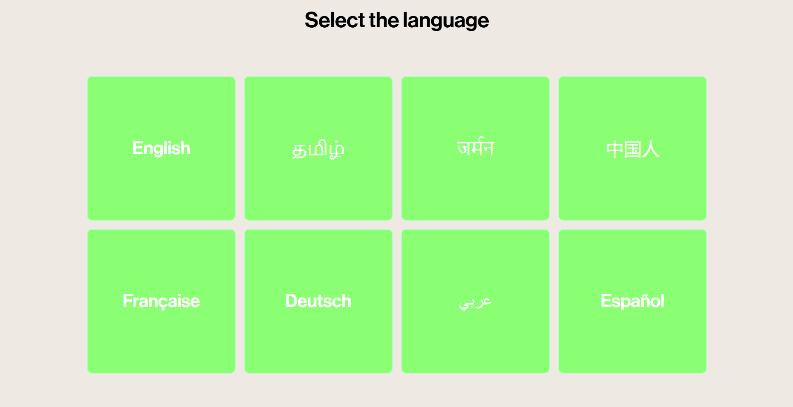
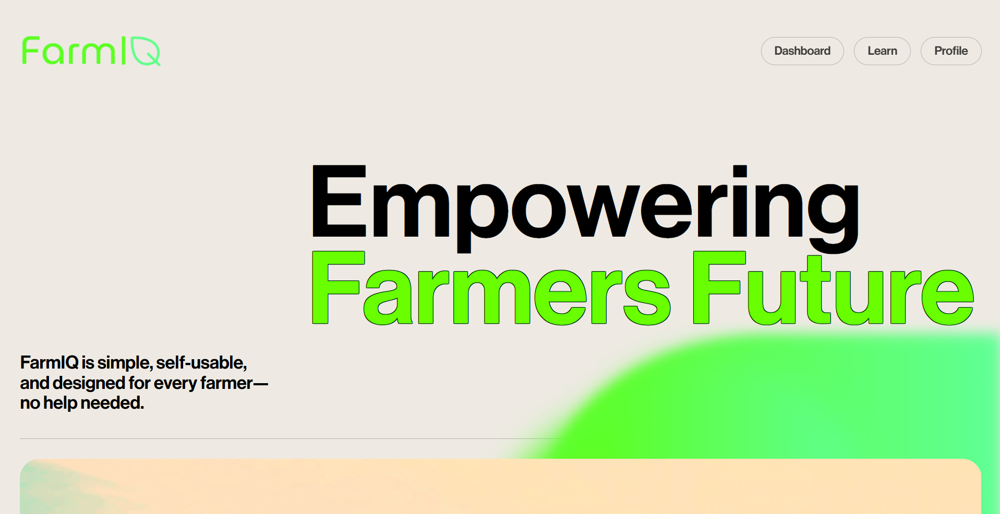
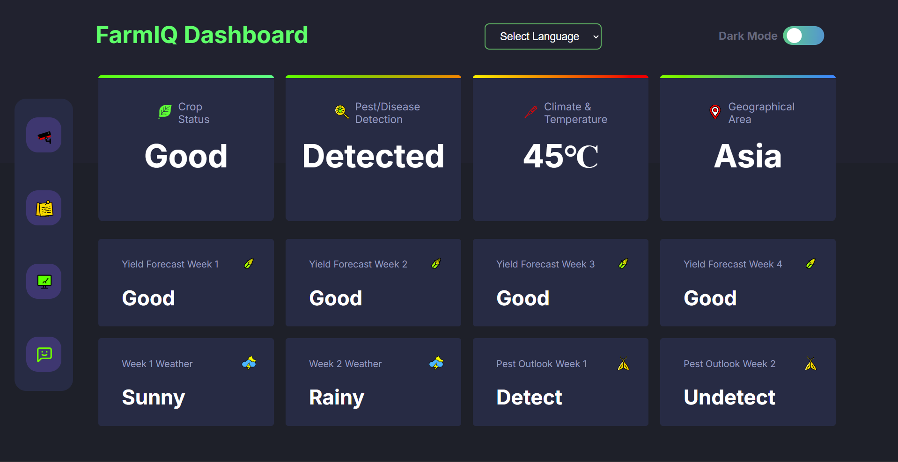
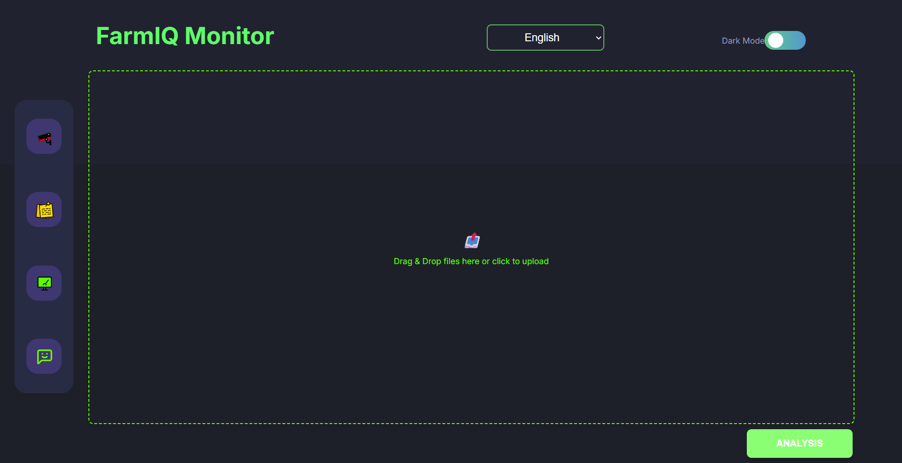
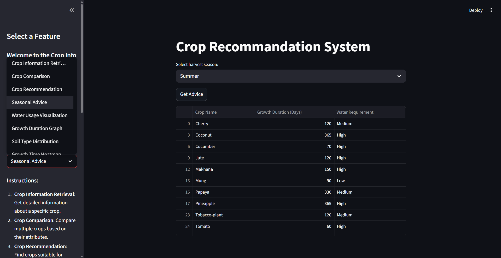
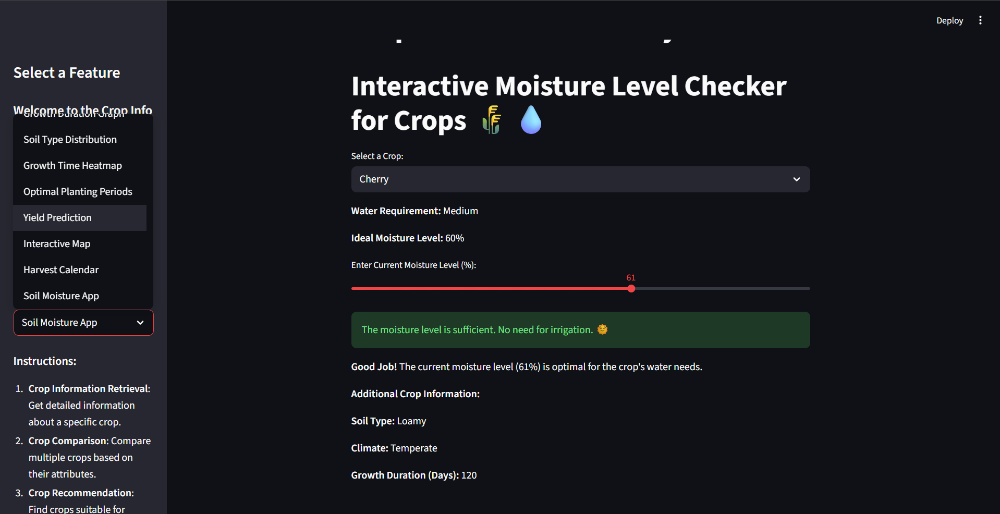

<div align="center">
  

  <h1 style="font-weight: 700; margin-bottom: 0;">
    FarmIQ® Official | Smart Agriculture Intelligence Platform
  </h1>
  
  <p style="color: #666; font-size: 1.1rem; max-width: 650px;">
    An AI-powered agriculture intelligence platform developed for 
    Smart India Hackathon (SIH) 2024. FarmIQ integrates crop monitoring, 
    crop identification, and intelligent recommendation systems to empower 
    farmers with data-driven decisions.
  </p>

  <div style="margin-top: 20px;">
    <a href="https://farmiq.netlify.app">
      
    </a>
  </div>

  <div style="margin-top: 15px;">
    
    
    
    
    
  </div>
</div>

<br><br>

## 🌾 Project Overview

**FarmIQ® Official (Phase 1)** is a full-stack agricultural intelligence platform built to solve real-world farming challenges under the Smart India Hackathon 2024 problem statement.

⚡ **Current Status:**  
- Phase 1 Completed  
- ~80% Functional Implementation  
- Frontend Fully Live  
- Backend Integration in Final Stage  

The platform enables:

- 🌱 Smart Crop Identification using AI Model (.h5)
- 📊 Farm Monitoring Dashboard
- 🌦 Real-time Crop Condition Monitoring
- 🌿 Intelligent Crop Recommendation System
- 🌐 Multi-Language User Access

FarmIQ bridges technology and agriculture by providing farmers with accessible, data-driven tools to improve productivity and sustainability.

> 🚀 **Note:** Full functional deployment link with backend + ML integration will be shared soon.

---

## 🧠 Core Modules

| Module | Description |
| :--- | :--- |
| **Language Selection Page** | Multi-language interface for accessibility. |
| **Landing Page** | Project introduction and navigation gateway. |
| **FarmIQ Dashboard** | Centralized control panel for monitoring farm analytics. |
| **FarmIQ Monitor Page** | Environmental and crop health tracking system. |
| **Crop Identifier** | AI-based crop detection using trained ML model. |
| **Crop Recommendation Page** | Suggests optimal crops based on soil and environmental parameters. |

---

## 🛠️ Technology Stack

| Domain | Technology | Implementation Details |
| :--- | :--- | :--- |
| **Frontend** |  | Semantic structure, responsive layout. |
| **Styling** |  | Flexbox, Grid, Animations, UI optimization. |
| **Scripting** |  | DOM manipulation, dynamic rendering. |
| **Backend** |  | ML model integration, API handling. |
| **Database** |  | Structured agricultural data management. |

---

## ✨ Key Features

- AI-Based Crop Detection Model
- Smart Crop Recommendation Engine
- Interactive Farm Monitoring Dashboard
- Multi-Page Structured Architecture
- Fully Responsive UI
- Clean and Optimized Frontend
- Full-Stack Integration (Frontend + Backend + Database)

---

## 📸 Interface Gallery

<div align="center">
  
  
</div>

<br>

<div align="center">
  
  
</div>

<br>

<div align="center">
  
  
</div>

---

## ⚡ Local Setup

```bash
git clone https://github.com/arvindvadivelu/FarmIQ.git

cd FarmIQ

# Install Python dependencies
pip install -r requirements.txt

# Run backend server
python app.py

# For Streamlit Chatbot (Optional)
streamlit run Chatbot.py

# Open index.html using Live Server
```

---

## 🏆 Hackathon Context

This project was developed as part of **Smart India Hackathon (SIH) 2024**, addressing agricultural intelligence and farmer support systems using AI and data-driven insights.

---

## 📈 Future Enhancements

- IoT Sensor Integration
- Real-time Weather API Integration
- Cloud-Based Model Hosting
- Farmer Analytics Reports
- Complete Backend Deployment

---

## 📜 License

This project is intended for academic and hackathon purposes.

---

<div align="center">
  <strong>© 2024 FarmIQ® | Phase 1 | Built with Innovation for Smarter Agriculture</strong>
</div>
